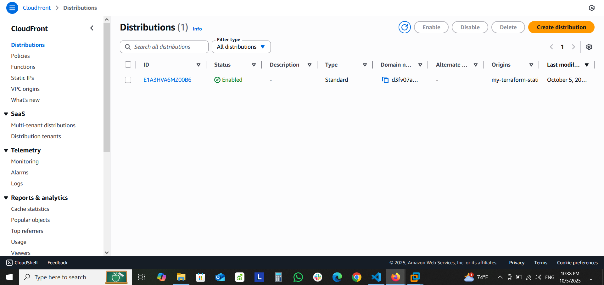

# ☁️ AWS Static Website Hosting using Terraform


## 📖 Overview
This project demonstrates how to **host a static website** on **AWS** using **Terraform** to provision and automate:
- An **S3 bucket** for static content hosting  
- A **CloudFront distribution** for global CDN caching  
- Proper **IAM bucket policies** for secure public access  

## 🧰 Tools & Technologies

| Tool                  | Purpose                      |
| --------------------- | ---------------------------- |
| **Terraform**         | Infrastructure as Code       |
| **AWS S3**            | Static Website Hosting       |
| **AWS CloudFront**    | CDN and SSL delivery         |
| **IAM Policies**      | Controlled Access Management |
| **AWS CLI / Console** | Verification & Screenshots   |

## 📁 Project Structure
```text
aws-terraform-static-website/
├── main.tf
├── variables.tf
├── terraform.tfvars
├── outputs.tf
├── providers.tf
├── versions.tf
├── .gitignore
├── README.md
├── assets/
|   ├── site-preview.png
|   ├── s3-bucket.png
|   ├── cloudfront-distribution.png
└── site/2137_barista_cafe
    ├── index.html
    ├── reservation.html
    ├── css/
    ├── fonts/
    ├── images/
    ├── js/
    ├── videos/
```
## ⚙️ Terraform Configuration Summary
Key Resources
 - S3 Bucket: Hosts website files

 - Bucket Policy: Grants public read access

 - CloudFront Distribution: Caches and serves website globally

 - Outputs: Displays CloudFront domain after deployment

## 🚀 Deployment Steps

### 1️⃣ Initialize Terraform
```bash
terraform init
```
###  2️⃣ Validate Configuration
```bash
terraform validate
```
### 3️⃣ Preview the Plan
```bash
terraform plan
```
### 4️⃣ Deploy the Infrastructure
```bash
terraform apply
```
### 5️⃣ Upload Website Files to S3
#### Upload all files from the site/2137_barista_cafe directory:
- index.html
- reservation.html
- css/
- images/
- videos/
- fonts/
#### Upload using AWS CLI:
```bash
aws s3 sync ./site/2137_barista_cafe s3://<bucket-name>
```
## 🧪 Verification Steps
### After deployment:
- #### Go to AWS Console → S3
  - ✅ Ensure bucket has “Static website hosting” enabled.
  - ✅ Files are visible in the bucket.
- #### Go to AWS Console → CloudFront → Distributions
  - ✅ Find the distribution.
  - ✅ Copy the Domain Name (e.g., d3fv07a7r5oude.cloudfront.net/)
- #### Paste that URL into the browser.
  - 🎉 The static website should load globally via CloudFront!

## 🖥️ Website Preview
  
## ☁️ AWS Resources
- S3 Bucket
   
- CloudFront Distribution
  


## 🧹 Destroy Infrastructure
#### To clean up all resources and avoid any future charges:
```bash
terraform destroy
```


